#  Gestor de Imagenes

> Aplicación web de gestión de imágenes desarrollada con **Laravel 12**, que permite a los usuarios administrar sus álbumes fotográficos de forma segura y organizada.

---

##  Tabla de Contenidos

- [Descripción General](#-descripción-general)
- [Tecnologías Utilizadas](#-tecnologías-utilizadas)
- [Requisitos Previos](#-requisitos-previos)
- [Instalación](#-instalación)
- [Estructura del Proyecto](#-estructura-del-proyecto)
- [Base de Datos](#-base-de-datos)
- [Funcionalidades](#-funcionalidades)
- [Evidencias](#-evidencias)
- [Autor](#-autor)

---

##  Descripción General

**Gestor de Imagenes** es un sistema web multi-usuario que permite a cada usuario registrado gestionar su propia colección de álbumes fotográficos. Cada álbum puede contener múltiples fotos con nombre, descripción e imagen. La aplicación implementa autenticación completa, autorización por propietario y operaciones CRUD para álbumes y fotos.

---

##  Tecnologías Utilizadas

| Tecnología | Versión | Rol |
|---|---|---|
| PHP | 8.2+ | Lenguaje backend |
| Laravel | 12.x | Framework principal |
| Laravel Breeze | 2.x | Autenticación |
| MySQL | 8.x | Base de datos relacional |
| Tailwind CSS | 3.x | Estilos y diseño responsive |
| Alpine.js | 3.x | Interactividad del navbar |
| Vite | 5.x | Compilación de assets |
| Blade | — | Motor de plantillas |

---

##  Requisitos Previos

Antes de instalar el proyecto, asegúrate de tener instalado:

- PHP 8.2 o superior
- Composer
- Node.js y npm
- MySQL 8.x
- Git

---

##  Instalación

Sigue estos pasos en orden para levantar el proyecto desde cero:

### 1. Clonar el repositorio

```bash
git clone https://github.com/LesterCorrea/Desarrollo-de-aplicaciones-en-internet---Lab13.git
cd GestorImagenes
```

### 2. Instalar dependencias PHP

```bash
composer install
```

### 3. Instalar dependencias JavaScript

```bash
npm install
```

### 4. Configurar el entorno

```bash
cp .env.example .env
php artisan key:generate
```

Edita el archivo `.env` con tus credenciales de MySQL:

```env
DB_CONNECTION=mysql
DB_HOST=127.0.0.1
DB_PORT=3306
DB_DATABASE=gestorimagenes
DB_USERNAME=root
DB_PASSWORD=
```

### 5. Crear la base de datos

Conéctate a MySQL y ejecuta:

```sql
CREATE DATABASE gestorimagenes CHARACTER SET utf8mb4 COLLATE utf8mb4_unicode_ci;
```

### 6. Ejecutar migraciones y seeders

```bash
php artisan migrate --seed
```

### 7. Crear enlace de almacenamiento

```bash
php artisan storage:link
```

### 8. Compilar assets y levantar el servidor

En dos terminales separadas:

```bash
# Terminal 1
npm run dev

# Terminal 2
php artisan serve
```

La aplicación estará disponible en: **http://127.0.0.1:8000**

###  Credenciales de prueba

| Usuario | Email | Contraseña |
|---|---|---|
| usuario0 | usuario0@mail.com | 12345678 |
| Yanina | yanina@mail.com | 12345678 |

---

##  Estructura del Proyecto

```
GestorImagenes/
├── app/
│   ├── Http/
│   │   ├── Controllers/
│   │   │   ├── AlbumController.php         # CRUD de álbumes
│   │   │   ├── FotoController.php          # CRUD de fotos + subida de imágenes
│   │   │   └── UsuarioController.php       # Actualizar perfil de usuario
│   │   └── Requests/
│   │       └── ActualizarPerfilRequest.php # Validación del formulario de perfil
│   └── Models/
│       ├── User.php                        # Modelo usuario (hasMany Album)
│       ├── Album.php                       # Modelo álbum (belongsTo User, hasMany Foto)
│       └── Foto.php                        # Modelo foto (belongsTo Album)
├── database/
│   ├── migrations/                         # Migraciones de las 3 tablas principales
│   └── seeders/                            # Datos de prueba para usuarios y álbumes
├── resources/
│   └── views/
│       ├── layouts/app.blade.php           # Layout principal con navbar
│       ├── auth/                           # Login y registro
│       ├── usuario/                        # Formulario de actualización de perfil
│       ├── album/                          # Vistas de álbumes y fotos
│       └── foto/                           # Formularios de creación y edición de fotos
├── routes/
│   └── web.php                             # Definición de todas las rutas
└── storage/
    └── app/public/fotos/                   # Imágenes subidas por los usuarios
```

---

##  Base de Datos

### Diagrama de relaciones

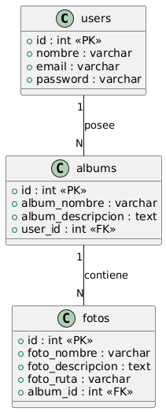

### Reglas de integridad

- Al eliminar un **usuario**, se eliminan en cascada todos sus **álbumes**
- Al eliminar un **álbum**, se eliminan en cascada todas sus **fotos**
- Al eliminar una **foto**, también se elimina su archivo físico del servidor

---

##  Funcionalidades

###  Autenticación
- Registro de nuevos usuarios con nombre, email y contraseña
- Inicio y cierre de sesión seguro
- Protección de todas las rutas mediante middleware `auth`

###  Perfil de Usuario
- Actualización de nombre
- Cambio de contraseña con confirmación (opcional)
- Validación con Form Request dedicado (`ActualizarPerfilRequest`)

###  Gestión de Álbumes
- Listar todos los álbumes propios en un grid responsivo
- Crear álbum con nombre y descripción
- Editar nombre y descripción de un álbum existente
- Eliminar álbum con confirmación (elimina fotos en cascada)
- Autorización: cada usuario solo puede gestionar sus propios álbumes

###  Gestión de Fotos
- Listar fotos de un álbum específico con visualización de imagen
- Crear foto con nombre, descripción e imagen (jpg, jpeg, png, gif, webp — máx. 4MB)
- Preview de imagen antes de subir
- Editar nombre, descripción y reemplazar imagen opcionalmente
- Eliminar foto con confirmación y borrado del archivo físico del servidor
- Imágenes almacenadas en `storage/app/public/fotos/`

---

##  Evidencias

### Pantalla de Inicio de Sesión
> Formulario de login con validación de credenciales.

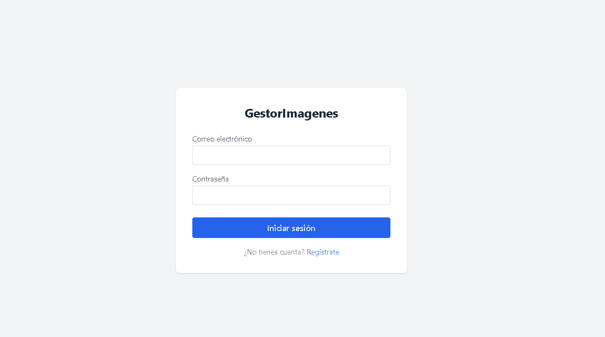

---

### Pantalla de Registro
> Formulario de registro con nombre, email y contraseña.

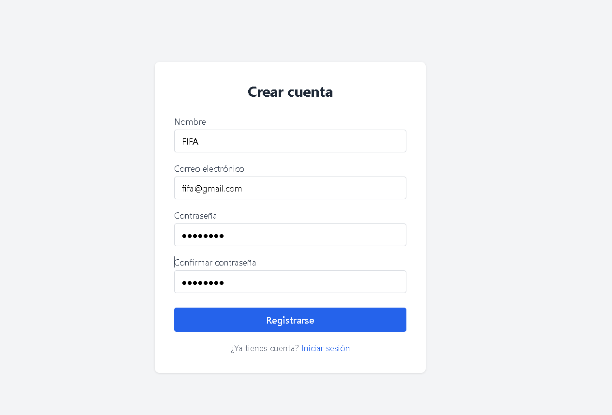

---

### Dashboard
> Pantalla principal luego de iniciar sesión con mensaje de bienvenida.

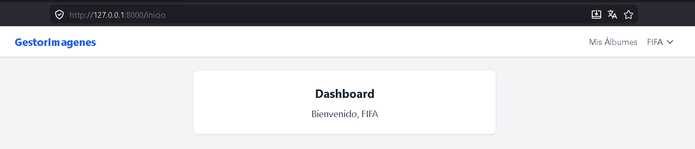

---

### Actualizar Perfil
> Formulario para actualizar el nombre y/o contraseña del usuario logueado.

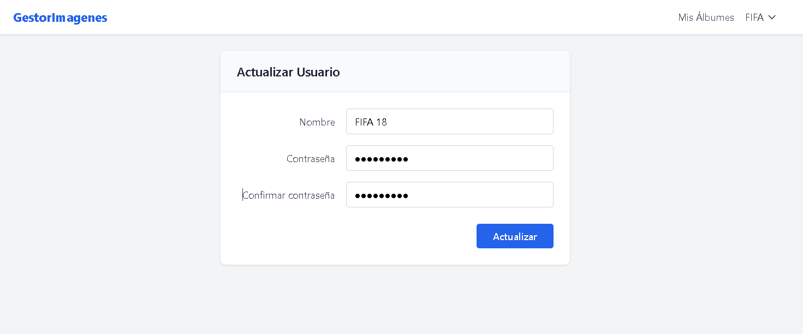

---

### Mis Álbumes
> Grid de álbumes del usuario con opciones de Ver Fotos, Editar y Eliminar.

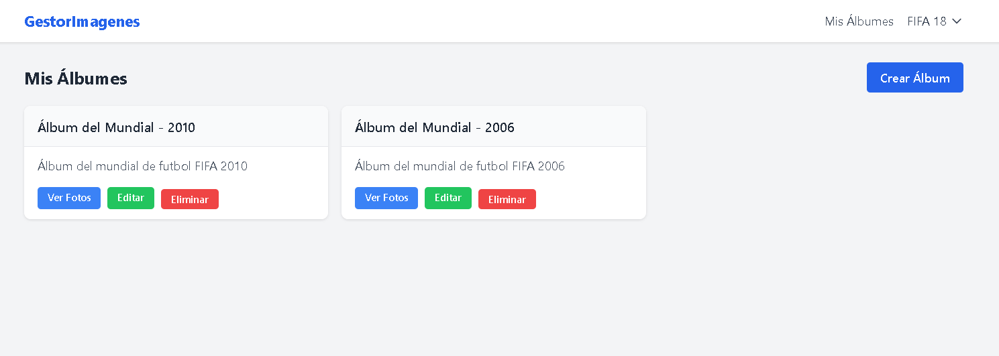

---

### Crear Álbum
> Formulario de creación de un nuevo álbum con nombre y descripción.

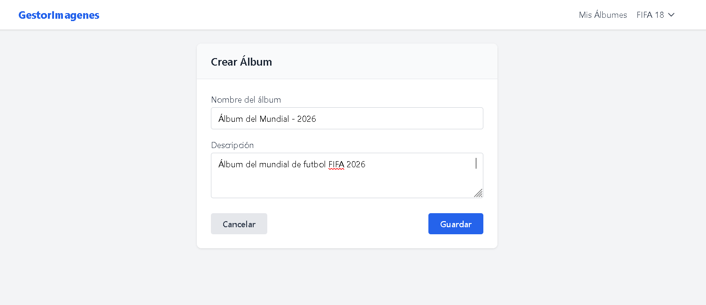

---

### Editar Álbum
> Formulario de edición con datos del álbum precargados.

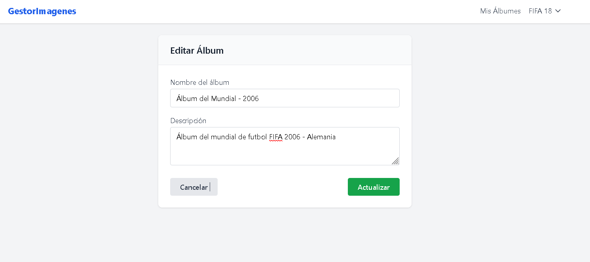

---

### Eliminar Álbum
> Eliminación de un Álbum.

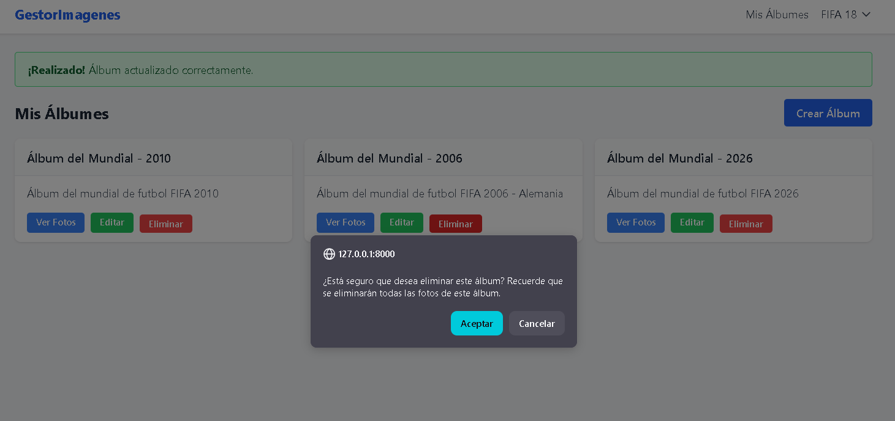

---

### Vista de Fotos de un Álbum
> Grid de fotos pertenecientes a un álbum, con imagen, nombre y descripción.

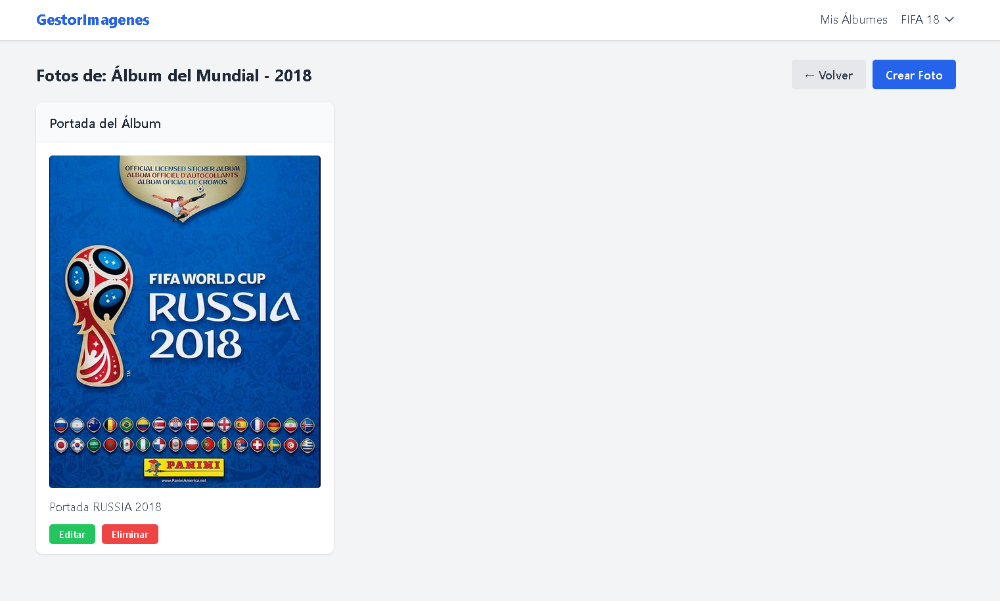

---

### Crear Foto
> Formulario de carga de foto con preview de imagen antes de guardar.

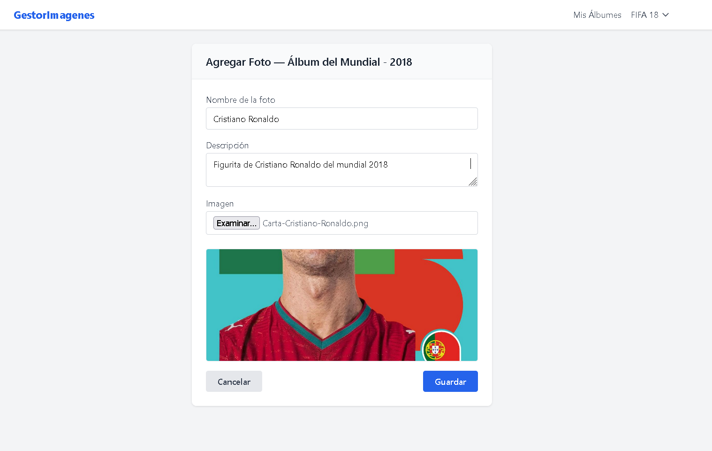

---

### Editar Foto
> Formulario de edición con imagen actual visible y opción de reemplazarla.

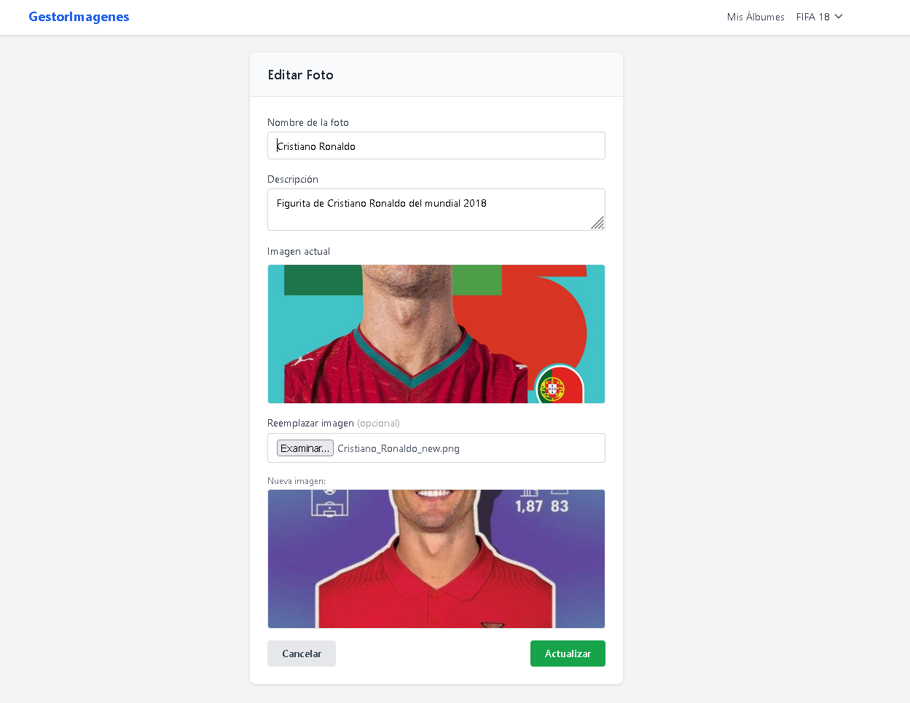

---

### Mensaje de Éxito
> Notificación global que confirma operaciones realizadas correctamente.

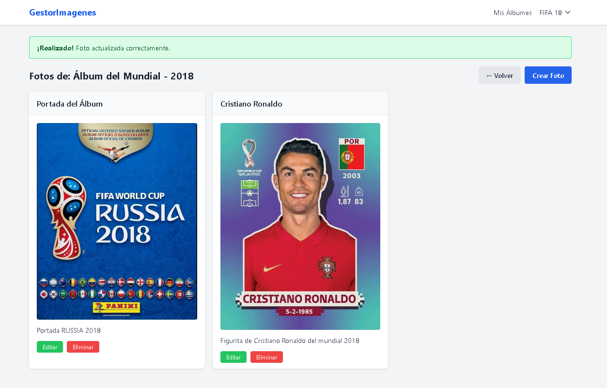

---

### Eliminar Foto
> Eliminación de una Foto.

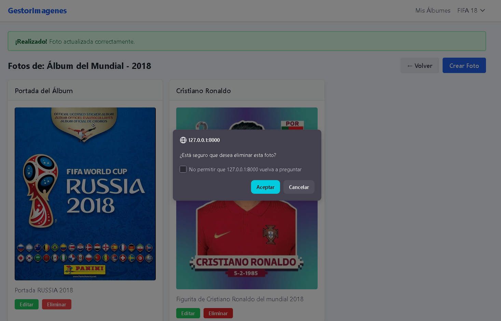

---

##  Autor
Lester Correa
<br>Desarrollado como parte del **Laboratorio N° 13 — Laravel Requests**
<br>Curso: Desarrollo de Aplicaciones en Internet
<br>Institución: TECSUP

---

## Licencia

> *Proyecto fue desarrollado con Laravel 12 siguiendo buenas prácticas de arquitectura MVC, validación con Form Requests, autorización por propietario y almacenamiento de archivos con Laravel Storage.*